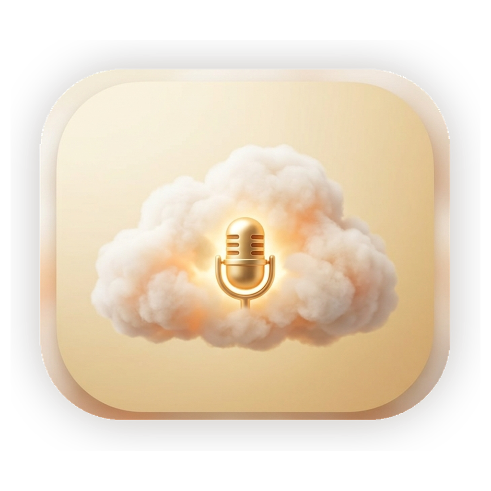

# Nimbus VTT

Local voice-to-text for Apple Silicon Macs. Press **F1** or **Option+Space** to record, transcribe with `mlx-whisper`, optionally clean up the text, and paste it into the focused app.

<p align="center">
  
</p>

Nimbus VTT is pure dictation. It does not answer questions, browse the web, run commands, or route requests to cloud assistants. OS commands, Q&A, web search, and assistant workflows belong in a separate assistant app such as Nimbus Assistant.

## Features

- 100% local transcription with `mlx-whisper`.
- Global hotkeys: **F1** and **Option+Space** by default.
- Post-processing modes: `agent_handoff`, `natural_prose`, `code_aware`, `minimal`, or `off`.
- Paste into the focused app via Accessibility, with clipboard fallback.
- Cloud-mic Dock icon and menu bar status glyph for idle, recording, and transcribing states.
- Warm floating HUD during record, transcribe, and paste.
- Status and settings windows for model, language, VAD, mic picker, hotkeys, output style, sounds, notifications, and launch at login.
- Persistent Whisper server for faster repeat dictation after warm-up.

## Requirements

- Apple Silicon Mac.
- macOS 13 or newer.
- Python 3.12, for example `brew install python@3.12`.
- Xcode command line tools, via `xcode-select --install`.

## Setup

```bash
./build.sh --check
./build.sh --install
open "/Applications/Nimbus VTT.app"
```

## Hotkeys

| Key | Action |
|-----|--------|
| **F1** | Toggle recording (default primary hotkey) |
| **Option+Space** | Toggle recording (default secondary hotkey) |

Hotkeys are configurable with `primary_hotkey` and `secondary_hotkey` in `~/Library/Application Support/VoiceToText/config.json`. Supported examples: `f1`, `f12`, `option+space`, and `command+shift+space`.

## CLI

```bash
~/Library/Application\ Support/VoiceToText/venv/bin/python cli/voice_to_text.py dictate
~/Library/Application\ Support/VoiceToText/venv/bin/python cli/voice_to_text.py devices --json
~/Library/Application\ Support/VoiceToText/venv/bin/python cli/voice_to_text.py prefetch
```

## Privacy

Transcription runs locally on your Mac. Audio is recorded to a temporary local file for each dictation and removed after transcription. Nimbus VTT does not include an assistant brain, cloud routing, web search, or command execution.

## Log And Config

Paths still use the legacy `VoiceToText` folder name for migration safety:

- Log: `~/Library/Logs/VoiceToText.log`
- Config: `~/Library/Application Support/VoiceToText/config.json`
- Venv: `~/Library/Application Support/VoiceToText/venv`
- App backups: `~/Library/Application Support/VoiceToText/Backups/`

## Permissions

1. **Microphone** - required to record audio.
2. **Accessibility** - required to paste transcribed text into the focused app.
3. **Notifications** - optional, only prompted when enabled in Settings.

If dictation records but does not paste, grant Accessibility in **System Settings > Privacy & Security > Accessibility**. If recording does not start, grant Microphone access in **System Settings > Privacy & Security > Microphone**. If settings look stale after reinstalling, check the legacy support folder at `~/Library/Application Support/VoiceToText`.

## Tests

```bash
./build.sh --check
~/Library/Application\ Support/VoiceToText/venv/bin/python -m pytest tests/ -q
./scripts/smoke_test.sh
./scripts/smoke_test.sh --runtime
```
